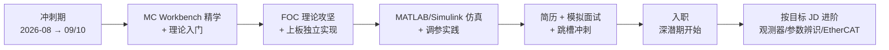

# 电机控制学习总计划

> 状态：待审阅 | 创建：2026-08-05 | 维护：Crino | 版本：v0.1

## 文档目的

这份文档是本次长线学习任务的顶层约定。它回答四个问题：学什么、为什么学、按什么节奏学、学完如何证明自己学会了。后续所有笔记、实验记录、日志都在此框架下产生；计划的任何调整都通过本文件的历史记录追踪。

---

## 一、任务定位

### 1.1 最终目标与评判标准

任务的价值排序：**收获知识 > 文档完善 > 代码可理解 > 项目跑通**。项目能转只是底线，不是目标；每一步学习都要留下可检索、可复盘的文档沉淀。

### 1.2 学习主线

电机控制（FOC 方向），承载平台为 NUCLEO-F401RE + X-NUCLEO-IHM07M1 开发板（2804 型电机）。这是转向机器人行业嵌入式开发的第一站，目标岗位要求见 2.1 节能力基线评估。

### 1.3 阶段策略

采用两段式：

1. **冲刺期（2026-08 → 2026-09/10）**：以 9-10 月完成行业跳槽为目标，学到足够入行的技能。
2. **深潜期（跳槽后）**：依托新岗位的实践机会，按目标 JD 进阶学习观测器、参数辨识、伺服算法、EtherCAT 等。

### 1.4 时间与精力约束

| 时段 | 用途 | 任务性质 |
|---|---|---|
| 周末完整时间 | 重度思考任务：FOC 原理、工程精读、仿真、上板实验 | 重 |
| 工作日晚上（碎片） | 轻任务：概念积累、协议学习、面试题、笔记整理 | 轻 |

工作日晚上已疲惫，不安排需要深度思考的任务。

### 1.5 学习方式

- 补课按"问题驱动"：遇到不会的概念再查，从问题发散深入原理，不做前置大段复习。
- 每个学习里程碑要求**独立完成**，核心算法代码不借助 AI 代写；AI 的角色是讲解原理、审阅实现、排查调试。
- 每次学习后由 AI 协助梳理成结构化文档，本人审阅后归档。

---

## 二、能力基线评估

### 2.1 目标岗位要求（电机控制方向 JD 提炼）

| 要求 | 现状 | 缺口 |
|---|---|---|
| 本科，电气/机电/自动化类 | 电气工程及其自动化 | 无 |
| 3 年以上 BLDC/PMSM FOC 驱动开发经验 | 无电机控制项目经历 | 最大缺口 |
| 熟悉电机驱动 MCU（STM32）、电机控制理论 | STM32 熟练，理论待建 | 中 |
| 精通 FOC、SVPWM、PID、数字滤波器、观测器 | 从零开始 | 需攻坚 |
| 精通 C，熟悉 TTL/CAN/串口/I2C/SPI/以太网 | C 强，串口/I2C/SPI 熟，CAN/以太网待补 | 中 |
| 电机原理、逆变电路、看懂电路图 | 有电气底子，多年未用 | 中，好补 |
| 熟悉 EtherCAT、CAN 现场总线 | 基本为零 | 大 |
| 示波器调试、硬件测试 | 有基本能力 | 中 |

### 2.2 真实能力画像（2026-08-05 评估）

**已有能力（不必补课，直接复用）：**

- C 语言功底扎实：Vtable 多态封装、状态机去抖、正弦查表呼吸灯（见 `STM32F103` 仓库 upgrade 分支）
- FreeRTOS 应用熟练：7 任务静态内存分配、DMA+TaskNotify 串口、Flash 双扇区参数存储
- 架构设计能力：五层架构（App→Protocol→Middleware→BSP→Driver）、单向依赖、文档完善
- 工程规范意识：commit 规范、.gitignore 打磨、代码质量评估报告习惯
- 电气工程理论底子

**知识性缺口（主攻方向）：**

- FOC 核心理论：坐标变换（Clark/Park）、SVPWM、电角度与极对数、传感器校准流程
- 电机本体知识：BLDC/PMSM 工作原理、逆变电路
- 通讯协议：CAN、EtherCAT（JD 硬性要求）
- MATLAB/Simulink 控制仿真
- MC Workbench 工具链的系统性理解

**关键判断：短板是知识不是代码。** 已跑通的电机分支（`feature/closedloop-control-v2`）移植自 SimpleFOC，代码质量高、有公开出处，是最好的对照教材；学习目标不是复述它，而是亲手实现并讲清原理。

---

## 三、路线图总览



| 阶段 | 时间 | 主题 | 验收 |
|---|---|---|---|
| 0 起步 | 2026-08-05 ~ 08-09 | 仓库建立、环境确认、旧实验复盘 | 首次提交、环境清单 |
| 1 工具链 | 08-10 ~ 08-23 | MC Workbench 精学 + 电机/FOC 理论入门 | 亲手走通工具流 + 笔记 |
| 2 核心攻坚 | 08-24 ~ 09-06 | FOC 算法理论 + 上板独立实现 | 闭环转动 + 独立实现 |
| 3 仿真调参 | 09-07 ~ 09-20 | MATLAB/Simulink 建模 + 调参对照 | 仿真模型 + 对比结论 |
| 4 求职冲刺 | 09-21 ~ 10-05 | 简历项目包装 + 面试准备 | 简历定稿 + 模拟面试 |

> 时间以周为弹性单位，实际推进按周末可用时间浮动；阶段 2 若推进顺利可压缩，为阶段 4 留余量。

---

## 四、冲刺期详细计划

### 阶段 0：起步（08-05 ~ 08-09）

**目标：** 建立仓库与文档体系，确认学习环境，把"电机已转起来"沉淀为第一份实验记录。

| 时段 | 任务 |
|---|---|
| 周末 | 审查并通过本计划；完成 git 首次提交；搭建远程仓库 |
| 周末 | 复盘 2804 电机首次转动过程，产出第一份实验记录 `2026xxxx-2804电机首次转动复盘.md` |
| 碎片 | 整理 MC Workbench 安装版本、SDK 版本、固件包信息，写入环境清单 |

**验收：** 仓库首次提交完成；第一份实验记录归档；环境清单可用。

### 阶段 1：MC Workbench 精学 + 理论入门（08-10 ~ 08-23）

**目标：** 搞懂 MC Workbench 生成工程的完整脉络，同步建立电机与 FOC 的概念框架。

| 时段 | 任务 |
|---|---|
| 周末 1 | MC Workbench 界面与配置流程精讲：工程结构、电机参数配置（极对数、额定电压/电流）、驱动板配置；对照已生成工程逐模块对应 |
| 周末 1 | 概念：BLDC/PMSM 结构、反电动势、换相原理；逆变电路（H 桥、三相桥）、PWM 驱动 |
| 周末 2 | 精读生成工程的代码结构：main、电机驱动初始化、FOC 库调用关系；动手修改一个参数（如目标转速）重新生成部署 |
| 周末 2 | 概念：FOC 概述——为什么用 FOC、dq 旋转坐标系思想 |
| 碎片 | ST 官方文档（UM1601、AN4630）阅读打卡；术语卡片积累（每工作日 1-2 个） |

**验收：** 能独立完成"改参数→重新生成→部署→电机响应变化"的完整闭环；产出一份 `MC-Workbench-01-工程结构解读.md` 笔记。

### 阶段 2：FOC 核心攻坚 + 上板独立实现（08-24 ~ 09-06）

**目标：** 亲手实现闭环 FOC 关键环节，把"会用"变成"会写"。

| 时段 | 任务 |
|---|---|
| 周末 1 | 坐标变换攻坚：Clark/Park 变换推导与代码实现；用 MATLAB/手算验证正确性；对照 SimpleFOC 源码理解工程实现 |
| 周末 1 | 电角度与极对数：传感器（编码器/磁编码器）读取、零点校准流程（对照已跑通的 AS5600 校准） |
| 周末 2 | SVPWM 攻坚：扇区判断、矢量作用时间、实现并上板验证（开环旋转）；PID 环路（电流/速度双环）结构与调参方法 |
| 周末 2 | 上板独立实现：在 F401 工程上从零写速度闭环关键代码（坐标变换+SVPWM 或闭环环路），不复用 AI 代写 |
| 碎片 | PID 调参经验、观测器概念预热（为深潜期铺垫）；面试题库积累 |

**验收：** 速度闭环转动且方向/转速可控；核心算法代码为本人实现并有逐行讲解能力；产出一份 `FOC算法-0X-坐标变换与SVPWM.md` 笔记。

### 阶段 3：MATLAB/Simulink 仿真 + 调参对照（09-07 ~ 09-20）

**目标：** 用仿真建立"参数→响应"的直觉，为面试的"你会调参吗"提供底气。

| 时段 | 任务 |
|---|---|
| 周末 1 | Simulink 电机控制建模：PMSM 模型 + FOC 控制环搭建，跑通开环→闭环 |
| 周末 1 | 用仿真实验理解 PI 参数对响应的影响（超调、稳态误差、响应速度） |
| 周末 2 | 仿真-实物对照：把仿真中的调参结论拿到板上验证，记录差异与原因 |
| 周末 2 | 用 MC Workbench 自带电机控制仿真/示波器工具，建立波形分析能力 |
| 碎片 | 电机控制相关英文术语与面试表达；看波形判断问题的套路 |

**验收：** 完整 Simulink FOC 仿真模型跑通；一份"仿真 vs 实物调参对照"实验记录；能用波形解释系统行为。

### 阶段 4：求职冲刺（09-21 ~ 10-05）

**目标：** 把学习成果转化为求职竞争力。

| 时段 | 任务 |
|---|---|
| 周末 1 | 简历重构：把 FOC 学习项目包装为可讲的项目经历（背景/方案/难点/结果），突出架构能力与 AI 提效素养 |
| 周末 1 | 目标岗位盘点：电机控制/伺服/变频器方向的初级岗，广撒网 |
| 周末 2 | 模拟面试：FOC 概念问答、项目深挖、手撕代码（C 基础） |
| 碎片 | 每天 30 分钟面试题刷练（电机控制八股 + C 语言 + 通讯协议） |

**验收：** 简历定稿并投递；完成至少 2 次模拟面试并复盘改进。

---

## 五、里程碑与验收标准

"独立完成"的统一标准：**核心算法与关键代码由本人编写，能脱离文档讲清每行含义，遇到问题能独立定位方向**。以下为各阶段硬性验收：

| 里程碑 | 验收标准 |
|---|---|
| M1 工具链闭环 | 能独立完成"改参数→重新生成→部署→验证响应"全流程 |
| M2 理论内化 | 能在不看资料的情况下讲清 Clark/Park 变换、SVPWM、电角度与极对数、校准流程 |
| M3 独立实现 | 速度闭环核心代码为本人实现；电机稳定转动；方向、转速可控 |
| M4 仿真能力 | Simulink FOC 模型跑通；能解释 PI 参数对响应的影响 |
| M5 求职就绪 | 简历定稿可投；模拟面试通过率达标（以面试官视角自评） |

---

## 六、工具链与学习资源

| 类别 | 资源 | 用途 |
|---|---|---|
| 工具链 | ST MotorControl Workbench（当前版本） | 生成工程、参数配置、波形观察 |
| 工具链 | STM32CubeIDE / CubeMX | 工程开发与调试 |
| 工具链 | MATLAB + Simulink（含电机控制工具箱） | 控制算法建模与仿真 |
| 官方文档 | UM1601（X-CUBE-MCSDK 用户手册）、AN4630（MC SDK 应用笔记） | 工具链与库解读 |
| 对照源码 | SimpleFOC 开源库（已跑通分支的移植来源） | FOC 算法逐行学习教材 |
| 理论 | 电机学、自动控制原理、信号与系统（问题驱动式查阅） | 补课按需 |
| 面试 | 电机控制面试题集、C 语言面试题集 | 阶段 4 使用 |

资源清单将在 `04-资料/资源清单.md` 持续维护，标注链接与阅读状态。

---

## 七、docs 文档体系约定

### 7.1 目录结构

```
docs/
├── README.md            # 导航首页
├── 01-计划/             # 路线图、阶段计划、里程碑、决策记录
├── 02-笔记/             # 主题归档笔记：电机原理 / FOC算法 / MC-Workbench / MATLAB仿真 / 总线协议
├── 03-实验/             # 上板实验记录（按日期命名）
├── 04-资料/             # 资源清单
└── 05-日志/             # 学习日志与周复盘
```

### 7.2 命名与状态约定

- 笔记：`主题-序号-标题.md`
- 实验：`YYYYMMDD-实验名称.md`
- 日志：`YYYY-MM-DD-学习日志.md` / `YYYY-MM-DD-周复盘.md`
- 所有文档开头标注：状态（进行中/待审阅/已完成）、日期、关联文档
- 每次学习后由 AI 协助梳理，本人审阅确认后归档，确保文档反映真实理解而非 AI 生成

### 7.3 历史文档处理

早期对话记录类文档已完成信息提取并删除，不保留在公开仓库中，避免包含个人背景信息。

---

## 八、git 仓库管理方案

### 8.1 仓库定位

新建独立仓库（与历史 `STM32F103` 仓库分离），承载本次电机控制学习主线，建议同名 `NUCLEO-F401RE`。

### 8.2 分支策略

- `main`：主线。MC Workbench 工程、docs 文档随主线提交，保持 main 干净可追踪
- 实验性分支：仅用于尝试性修改（如某个算法变体），验证后合回 main 或删除
- 学习过程的分支不宜过多，主线即文档与代码的最终形态

### 8.3 提交规范

沿用已有习惯，`类型：描述` 格式：

- `docs:` 文档变更
- `feat:` 新功能/新实验
- `fix:` 修复
- `refactor:` 重构
- `chore:` 构建、配置等杂项

示例：`docs: 新增 FOC 坐标变换学习笔记`、`feat: 实现速度闭环核心代码`

### 8.4 提交节奏

- 每次学习/实验结束归档后提交一次，周末至少一次提交
- 文档与对应代码变更同次提交，保持可追溯
- 周复盘时核对本周提交，确认进度与日志一致

### 8.5 落地步骤

1. 本地：清理工作区（确认 `.gitignore` 覆盖编译产物、日志/备份文件），完成首次提交
2. 远程：GitHub 新建 `NUCLEO-F401RE-IHM07M1_FOC` 仓库（公开，作为简历门面）
3. 关联：`git remote add origin` 并推送 main
4. 后续：按提交规范持续维护，推送前执行 8.6 检查清单

### 8.6 推送前检查（固定机制，每次推送必须执行）

**背景**：2026-08-06 曾因历史版本中残留敏感文字（岗位 JD、个人背景摘要）导致公开仓库泄露，教训是验证必须覆盖"文件名 + 文件内容"两个维度。以下检查在任何 `git push` 前强制执行，不依赖对话记忆。

**敏感词表**：本地文件 `.git_sensitive_words.txt`（仓库根目录，已在 `.gitignore` 中排除，禁止提交）。该文件包含全部个人敏感词，推送前检查时以它为词表执行 `git grep`。**注意：词表文件自身含敏感词，任何情况下不得 add 进 git**。

检查清单（顺序执行，全部通过才允许推送）：

1. **工作区状态**：`git status` 确认无未提交改动，提交信息规范（`docs:`/`feat:`/`fix:` 前缀）
2. **文件名扫描**：历史全部提交中不得出现敏感文件，以 `.git_sensitive_words.txt` 为词表执行
   `git log --all --name-only --pretty=format: | Select-String -Pattern "($(Get-Content .git_sensitive_words.txt | Where-Object { $_ -and -not $_.StartsWith('#') } | ForEach-Object { [regex]::Escape($_) }) -join '|')"`
3. **文件内容扫描**：HEAD 全文件不得包含敏感词，以 `.git_sensitive_words.txt` 为词表执行
   `git grep -l -E "($(Get-Content .git_sensitive_words.txt | Where-Object { $_ -and -not $_.StartsWith('#') }) -join '|')" HEAD -- .`
   注意：此检查针对**文件内容**，是 2026-08-06 教训的核心补充
4. **本地路径/用户名扫描**：HEAD 全文件不得出现本机绝对路径前缀与 Windows 用户名（可追加到词表检查）
5. **提交作者**：`git log --format='%an <%ae>'` 确认全部使用 GitHub 隐私邮箱（见第 8.7 节），不使用真实邮箱
6. **推送后复核**：推送完成后从远程重新克隆，对克隆副本重复执行第 2、3 项扫描，确认远程与本地一致

**扩展规则**：任何涉及"公开仓库内容检查"的场景（包括新建笔记、实验记录归档），都按此清单执行；敏感词可随时追加到 `.git_sensitive_words.txt`。

### 8.7 提交身份

本仓库提交必须使用 GitHub 隐私邮箱（noreply 格式，防止真实邮箱随提交泄露）。当前全局 git 邮箱若为真实邮箱，已在仓库级配置覆盖。检查方式：`git config user.email`。

---

## 九、AI 协作原则

| 场景 | AI 的角色 |
|---|---|
| 原理讲解 | 用通俗语言讲清概念，配合推导与图示 |
| 笔记梳理 | 每次学习后协助生成结构化文档，供审阅 |
| 代码审阅 | 审查本人实现，指出问题并解释原因 |
| 调试排错 | 协助定位问题方向，不直接代写核心算法 |
| 面试准备 | 出题、模拟面试、简历话术打磨 |
| 推送检查 | 每次 `git push` 前强制执行 8.6 检查清单（文件名 + 文件内容 + 作者邮箱），全部通过才推送 |
| 禁止事项 | 不代写 FOC 核心算法代码；不虚构学习进度或实验数据 |

---

## 十、变更记录

| 日期 | 版本 | 变更 |
|---|---|---|
| 2026-08-05 | v0.1 | 初稿：两段式路线、冲刺期五阶段、里程碑、文档约定、git 方案 |
| 2026-08-06 | v0.2 | 仓库改为公开并重建为单提交干净历史；新增 8.6 推送前检查固定机制；落地步骤更新为实际仓库名 |

